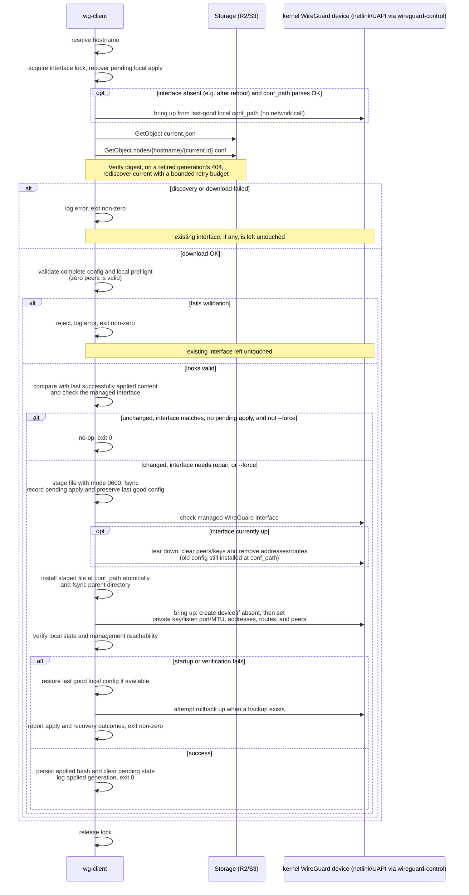

# `wg-client` — Design Document

Status: design only, no implementation yet.

## 1. Purpose

`wg-client` runs on every VPN node (master or spoke). It:

1. Reads a small JSON config with read-only storage credentials and a
   local target path.
2. Determines this node's own hostname.
3. Reads `{bucket}/current.json` to discover the current generation, then
   downloads `nodes/{hostname}/{generation-id}.conf` from that bucket
   and verifies its digest (see [wg-server.md §10](./wg-server.md#10-upload-to-storage)).
4. Reconfigures the WireGuard interface directly from that file — creating
   the kernel device if needed and pushing keys/peers/routes over netlink —
   so the node picks up the latest topology/keys.

`wg-client` talks to the kernel the way
[innernet](https://github.com/tonarino/innernet) does: through the
`wireguard-control` crate's netlink/UAPI calls, in-process. It does not
shell out to `wg`, `wg-quick`, or any other external tool, and depends on
neither Bash nor the `wireguard-tools` package being installed. `wg-quick`
INI syntax remains the *storage/interchange format* — `wg-server` renders
it and `wg-common` parses it — but no `wg-quick` binary is ever invoked to
apply it; see §6 and §8.

Each client runs **daily at 00:30**, while the stateless server runs
**daily at 00:00**. Use a common scheduler timezone (UTC in these examples).
Prefer a scheduled `--once` invocation via cron or a systemd timer; an
optional daemon loop
uses the same sync algorithm. Unchanged, successfully applied content
does not flap a running tunnel.

The bucket retains the current generation and **one previous committed
generation**. Clients always target current and may skip intermediate
generations. Each generation is a full configuration, so a client needs
neither the previous remote generation nor an acknowledgement exchange
with the server to catch up.

## 2. Non-goals

- Does not generate keys or decide topology — it only applies what
  `wg-server` published.
- Does not provision gateway forwarding, NAT, or site firewall policies.
  It applies the validated address/route/DNS subset in §6. Downloaded
  shell hooks and default-route configurations are rejected in v1.
- Does not provision the read-only credentials — the operator creates
  those and deploys the client config file out of band (config management,
  secrets manager, image bake, etc.).

## 3. CLI

```
wg-client sync --config <path> [--hostname <name>] [--once | --daemon] [--interval <duration>] [--force]
```

| Flag | Default | Meaning |
|---|---|---|
| `--config <path>` | required | Path to the client JSON config (§4). |
| `--hostname <name>` | system hostname | Overrides hostname detection (§5). Useful in containers/VMs where the system hostname doesn't match the fleet naming. |
| `--once` | default mode | Run a single sync pass and exit. |
| `--daemon` | off | Loop forever, sleeping `--interval` between passes, until `SIGTERM`/`SIGINT`. |
| `--interval <duration>` | `24h` | Only meaningful with optional `--daemon`. Must be positive. This is a relative sleep interval; the fixed daily 00:30 deployment uses cron/timer-controlled `--once` runs. |
| `--force` | off | Reapply (down/up) even if the downloaded content is byte-identical to what's already at `conf_path`. |

Exit codes: `0` success/no-op, `1` sync/apply/recovery failed, `2` local
config/validation error. Failures before local application leave the
existing tunnel untouched. Apply failures can interrupt it; report whether
rollback restored service or also failed.

Acquire a nonblocking exclusive `flock` on `/run/wg-client/<iface>.lock`,
using the validated interface name from `conf_path`. There is no custom
lock-path override that could bypass mutual exclusion. Hold the lock for
the whole pass, including recovery and downloads, and release it before
daemon sleep. Never unlink the lock file. Restrict `/run/wg-client` to root,
reject symlinks, and close the lock descriptor on subprocess exec. Manage
an interface in one network namespace and with one owner only: do not also
enable `wg-quick@<iface>`, NetworkManager, or another tunnel controller for
the same interface — even though `wg-client` no longer invokes `wg-quick`
itself, a second controller writing to the same netlink device would still
race it. A second invocation fails immediately with exit 1.

`/run` is typically tmpfs and does not survive a reboot, so `wg-client`
must create `/run/wg-client` itself rather than assume it exists.
Create it (and the lock file within it) with `O_NOFOLLOW`/directory-relative
operations, mode `0700`, root-owned. If the path already exists, verify it
is a real directory (not a symlink or other file) with the expected
ownership and mode before using it — fix the mode if it's merely wrong,
but refuse to proceed (report a critical error) if it's a symlink or owned
by another user, rather than silently reusing a directory an unprivileged
process could have pre-created.

## 4. Client configuration schema

```json
{
  "r2_config": {
    "endpoint": "https://<accountid>.r2.cloudflarestorage.com",
    "read_only_access_key_id": "",
    "read_only_secret_access_key": "",
    "session_token": "",
    "region": "auto",
    "bucket": "wg-confs"
  },
  "conf_path": "/etc/wireguard/wg0.conf"
}
```

| Field | Type | Required | Notes |
|---|---|---|---|
| `r2_config.endpoint` | string (URL) | yes | Same authenticated HTTPS endpoint the server publishes to. Reject HTTP, URL userinfo, query strings, and fragments; require normal certificate validation. |
| `r2_config.read_only_access_key_id` / `read_only_secret_access_key` | string | yes | Distinct per-node credentials permitting `GetObject` for `current.json` and `nodes/{hostname}/` only (see wg-server.md §12). No listing or writing is needed. Must **not** be the server or credential issuer's pair. |
| `r2_config.session_token` | string | conditional | Required for temporary credentials such as scoped R2 tokens. Omit for a long-lived pair; when present it must be nonempty. All blank credentials in this example are deployment placeholders. |
| `r2_config.region` | string | yes | `"auto"` for R2. |
| `r2_config.bucket` | string | yes | Must match the bucket `wg-server` publishes to. |
| `conf_path` | string (path) | yes | Absolute installation path in a trusted root-owned directory. Filename must be `<iface>.conf` with a 1–15 character interface name (the Linux `IFNAMSIZ` limit) matching `[a-zA-Z0-9_=+.-]+`, excluding `.` and `..`. The stem is the interface name passed to netlink/UAPI calls and used for kernel checks and locking. |

**`conf_path` is fixed across generations.** For example, each download
from `nodes/workstation-01/<generation-id>.conf` is installed at the same
`/etc/wireguard/wg0.conf`. Never append the generation ID to this path or
derive the local interface name from the remote object filename. The
backup stays `/etc/wireguard/wg0.conf.bak`; generation IDs belong only to
remote object names and local metadata.

Parse strictly: reject duplicate JSON keys, unknown fields, invalid values,
and missing required fields. The directory and config/credential files
must meet §10's ownership and permission rules before the first request.

Hostname discovery keeps shared nonsecret configuration reusable, but
credentials are specific to each node. Provision and renew them out of
band, atomically replacing this JSON file before temporary credentials
expire. Every pass reloads the file and constructs its SDK credentials
explicitly, including the session token, without a fallback to environment
or instance credentials. In daemon mode, `conf_path` and the resolved node
identity remain fixed until restart; reject changes to either during a
reload. An invalid reload leaves the running tunnel untouched.

## 5. Hostname resolution

Resolved in this order, first match wins:

1. `--hostname` CLI flag.
2. `WG_CLIENT_HOSTNAME` environment variable.
3. System hostname (`gethostname(2)`, e.g. via the `hostname` crate).

Apply ASCII lowercasing consistently to the selected source. An explicitly
provided but empty value is an error, not a request to try the next source.
Do not trim an FQDN to its first label or silently remove other characters;
use `--hostname` when the system name differs from the registered label.

The resolved value is validated against the same rule `wg-server` uses
(`^[a-z0-9]([a-z0-9-]{0,61}[a-z0-9])?$`) before being used to build the
object key `nodes/{hostname}/{generation-id}.conf`. A mismatch here
(e.g. the hostname contains underscores or an FQDN suffix) is a
configuration error — fail with a clear message rather than silently
requesting a nonexistent object.

## 6. Sync algorithm

### Discovering the current generation

The discovery object always has the fixed key **`current.json`** in the
configured bucket. Its schema is defined in
[wg-server.md §10](./wg-server.md#10-upload-to-storage). First acquire the
interface lock and recover any pending local transaction (see "Local
application" below).

Then, independent of whether a transaction was pending, and **before any
network call**, check whether the managed interface currently exists.
Query the kernel directly for this on every pass — never assume a
previous pass's result still holds — the same way
[innernet](https://github.com/tonarino/innernet)'s client daemon
re-checks `interface_is_up()` from the kernel on every single loop
iteration rather than caching that answer between calls. If the interface
is absent (most commonly: this is the first pass after a reboot, since a
reboot clears the kernel's WireGuard devices but not the files on disk)
and `conf_path` holds a file that still parses under the shared validator,
bring the interface up directly from that file — innernet's daemon does
the equivalent thing, reconfiguring the interface from its local
`InterfaceConfig` (and, for peers, its locally cached last-known-good
peer list) before it ever contacts its own coordination server. If
`conf_path`'s content fails validation (e.g. corrupted), skip this local
restore and fall through to discovery below, which will install a fresh,
freshly-validated file if one is reachable.

This local-first restore is what makes a reboot self-healing without
depending on storage reachability at that instant, and without needing a
separate boot-time unit (such as `wg-quick@<iface>`, §3/§7) layered on
top of the scheduled sync: the tunnel comes back from `wg-client`'s own
next run, using only what is already on disk, the same way innernet
needs no separate boot mechanism beyond starting its one long-running
daemon. The discovery/download steps below can still supersede this
local copy with a newer generation once storage is reachable, but they
are not what brings the interface up in the first place after a reboot.

With the interface reconciled from local state, discovery proceeds:

1. Fetch and validate `current.json`. Read `current.id` and find this
   hostname in `current.nodes`. A missing/empty publication or absent
   hostname is an error; keep the existing tunnel unchanged. Do not select
   `previous` as a fallback for a removed node.
2. Validate the ID as exactly 52 lowercase Crockford Base32 characters
   matching `^[01][0-9abcdefghjkmnpqrstvwxyz]{51}$`. It encodes 32 random
   bytes, using the canonical encoding defined by the server. Construct
   `nodes/{hostname}/{current.id}.conf`; never follow an arbitrary
   URL or path from downloaded metadata.
3. Enforce the shared limits: 16 MiB for discovery JSON, 4096 nodes, and
   1 MiB per configuration, regardless of `Content-Length`. Each is an
   inclusive maximum (see [wg-server.md §6](./wg-server.md#6-hostname--topology-validation)) —
   reject only the first byte/node past it, not an exactly-at-limit value.
   Download the entire file with a finite deadline. Compute
   SHA-256 over its exact bytes and encode the 32-byte digest using the
   same 52-character lowercase Crockford Base32 format. Compare it with
   `current.nodes[hostname]`, then validate the configuration before making
   any local change. All persisted or logged application digests use this
   encoding too; storage ETags remain opaque and WireGuard keys use Base64.
4. If the generation object returns 404, reread `current.json`. If current
   has changed, restart discovery against the new generation; cleanup may
   have removed the earlier one. If it is unchanged, report a missing
   referenced object as an integrity error. Limit a sync pass to three
   discovery rounds; on exhaustion leave the tunnel unchanged and let the
   next scheduled run try again.

Some providers, including S3 without `ListBucket`, return 403 for missing
objects. Do not label every 403 as bad credentials. For a configuration
GET returning 403, reread the pointer once within the same discovery
budget: retry a changed generation, or report access-denied/object-missing
ambiguity when it is unchanged. A 403 on the pointer is a terminal read
failure for this pass; never broaden credentials just to improve diagnostics
([S3 GetObject behavior](https://docs.aws.amazon.com/AmazonS3/latest/API/API_GetObject.html)).

For example, `current.id = "189c8r7s5x4dcvhq7acet5dr0zpc592e13rxd8xgk3nqe1hxj9d4"` and hostname
`workstation-01` resolve to
`nodes/workstation-01/189c8r7s5x4dcvhq7acet5dr0zpc592e13rxd8xgk3nqe1hxj9d4.conf`.
The client never lists generations or infers their order from IDs or its
clock. A fully downloaded, verified file remains usable if its generation
is later removed from storage; publication and local application are
independent operations.

### Accepted configuration subset

Use the shared parser for both server output and client downloads. Require
exactly one `[Interface]` with a valid nonzero `PrivateKey`, one IPv4
unicast `/32` `Address`, and `ListenPort` in `1`–`65535`. Optional interface
fields are one resolver IP in `DNS` and `MTU` in `576`–`65535`.

Allow zero or more `[Peer]` sections. Each requires a valid nonzero
`PublicKey`, nonzero `PresharedKey`, and nonempty IPv4 `AllowedIPs`.
Optional fields are a syntactically valid `Endpoint` and
`PersistentKeepalive` in `0`–`65535`. Apply server §6's range and prefix
ownership rules, including no default routes, overlaps between peers, or
routes covering the local tunnel address. Reject duplicate directives,
duplicate peer keys, peers matching this node's own public key, unknown
sections/directives, control characters inside values, and malformed
32-byte Base64 keys. Accept the renderer's LF line endings and ordinary
spaces; reject NUL and other control characters. Comments are informational,
not an identity source.

Explicitly reject `PreUp`, `PostUp`, `PreDown`, `PostDown`, `SaveConfig`,
`Table`, and arbitrary shell text. This isn't defense-in-depth around a
shell-hook-capable applier — `wg-client` never hands the file to `wg-quick`
or any other interpreter that would execute these directives — but the
shared parser still rejects them outright rather than silently ignoring
them, since a config that names them is not a config this fleet renders
and warrants treating as untrusted. There is no `wg-quick strip`-style
partial stripping step to lean on either way: `wg-common`'s parser is the
only thing that ever reads these bytes, and it accepts or rejects the
whole file. Any external command `wg-client` does invoke (e.g. `resolvconf`
integration, §8) uses argument arrays, never shell interpolation.

Before teardown, resolve endpoint names with a finite deadline, verify
required utilities and DNS integration, and check candidate routes against
the local routing table. Reject overlaps with another interface's nondefault
routes; an ordinary underlay default route is not itself a conflict.
Reject any candidate route that captures configured DNS, storage addresses,
or WireGuard transport endpoints. The storage endpoint and its resolver
must remain usable over the underlying network when the tunnel is down.
Keep the current configuration on any preflight error.

### Local application



The node's local applied-state record at `conf_path + ".state.json"` and
backup persist on that node, independently of the stateless server.
Recover an interrupted local apply before considering a content-hash
no-op. A missing or down interface must be brought up even when the
downloaded bytes match the installed
file. Check that the device is WireGuard and that managed settings match;
mere existence under `/sys/class/net` is insufficient.

Record the owning hostname/interface, last applied generation and digest,
and any pending transaction's prior state/backup digest in the state file.
Reject an unexpected local identity change and a non-WireGuard device
using the requested interface name. A pre-existing untracked config can
be adopted only after validation and comparison with its running managed
state; otherwise report the ambiguity for operator recovery. Do not assume
an arbitrary existing file is a previously successful application.

Compare the managed addresses, MTU, listen port, local public key, peer
keys/PSKs, allowed routes, keepalives, and managed DNS state. Do not treat
WireGuard's learned roaming endpoint, handshake timestamps, or counters as
configuration drift. Inspect secret kernel fields in memory only. A new
generation with identical node bytes may update the recorded observed
generation without overwriting the previous local backup.

Keep at most one previous successfully applied local configuration as
`conf_path + ".bak"`, with the same secret-file protections as `conf_path`.
It may be older than the bucket's `previous` generation because the node
can skip publications. Do not fetch the remote previous generation as an
automatic substitute for this node's own last good configuration.

Handle teardown, installation, and startup errors explicitly. Stop the
new apply after failed teardown and attempt recovery from the preserved
local state. On first installation there may be no backup: clean up a
failed partial startup and report failure without inventing a rollback.
If recovery fails, retain recovery information and report a critical
failure. Successfully pushing the new keys/peers/addresses over
netlink/UAPI establishes local configuration, not proof that every peer
has adopted compatible keys or is reachable.

After startup, verify managed local state and perform a bounded DNS/storage
reachability check before marking the apply successful. Roll back a
configuration that breaks the node's management path. VPN connectivity is
a separate observation: idle peers can have old handshakes, and independent
polling can temporarily leave peers on incompatible keys. Do not roll back
solely because a peer has not yet updated. Operators should actively probe
required VPN paths after the next scheduled client passes and correct or
recover the publication if connectivity remains broken (§11 of wg-server).

Local transaction ordering is durable: stage/fsync the candidate, then
securely write/fsync a backup of the last successfully applied file and
persist the pending marker before teardown. Tear down using the old file
and atomically install the candidate. Atomically record the new applied
digest and clear pending state only after local verification succeeds.
Fsync parent directories after metadata renames. While pending, never
replace the last good backup with unverified installed bytes. On restart, pending state
triggers recovery from that backup, even when disk bytes match storage.
First-install pending state records that no prior configuration existed.

### Retry policy

Each `GetObject`, for discovery or configuration, has up to **5 attempts
total**, matching `wg-server`'s policy (see
[wg-server.md §10](./wg-server.md#10-upload-to-storage)):

- Only transient errors are retried (timeouts/connection resets, retryable
  5xx, and provider throttling errors), with exponential backoff and jitter
  between attempts
  (1000ms base, doubling, capped around 5s).
- A 404 is not retried against the same key. A missing generation object
  invokes the bounded rediscovery rule above; a missing `current.json`
  means no publication is available and leaves the tunnel untouched.
- Auth errors are not retried against the same resource with the same
  credentials. Apply the generation-rediscovery exception for ambiguous
  configuration 403s described above; otherwise wait for credential renewal.
- Configure the SDK attempt limit and 5s backoff cap explicitly. Also
  bound request duration, streamed-body consumption, subprocess execution,
  and the entire sync pass; attempt counts alone do not bound elapsed time.
- SDK and streamed-body retries share the five-attempt per-call budget.
  Restart an interrupted body from the same immutable object within the
  remaining budget; do not introduce a second five-attempt loop around it.
- Use 10s per HTTP attempt and 30s for each complete call, including body
  consumption and retries. Allow at most 180s total for discovery/download:
  worst case is 3 discovery rounds × 2 calls (`current.json` plus the
  generation file) × 30s, which exactly fills this budget, so preflight is
  bounded separately rather than sharing it. Preflight (resolving endpoint
  names, checking utilities/routes) gets its own 20s budget. All startup
  recovery, candidate application, and rollback share a single 120s
  local-operation budget, with 30s per subprocess. Cancel and reap a
  timed-out subprocess before any recovery command to prevent concurrent
  interface mutation. The complete pass is bounded by 320s (180 discovery/
  download + 20 preflight + 120 local-operation); a failure preserves
  durable pending state when recovery is incomplete.
- These per-call budgets and the three-round discovery limit apply within
  one sync pass. The next scheduled invocation, or the next daemon interval
  (§7), gets a fresh budget.

Key properties this preserves:

- **Preserve the tunnel on pre-apply storage/network failure.** A new
  publication is applied only after discovery, download, digest verification,
  and validation complete. Startup recovery may restore the existing local
  configuration independently; post-apply health failures trigger rollback.
- **Validate before installation.** The digest confirms the downloaded
  bytes match the publication; semantic validation rejects malformed keys,
  addresses, and directives. A valid zero-peer configuration must be
  accepted so removing a node's final peer can take effect.
- **Attempt local rollback on apply failure.** Preserve a last good local
  configuration when one exists and report whether recovery succeeded.
- **No unnecessary flaps.** A new fleet generation may contain exactly the
  same bytes for this node. Compare configuration content and applied state,
  not generation IDs alone, when deciding whether to reapply.

The interface name used for every netlink/UAPI call is the validated stem
of `conf_path` (§4), never a name looked up under `/etc/wireguard` by
convention — `conf_path` is user-configurable and may not live there at
all. There is no `wg-quick`-style CLI in between accepting either a path
or an interface name: `wg-client` talks to the kernel device directly, so
`conf_path` only ever needs to resolve to the interface name it encodes.

## 7. Scheduling and daemon mode

The primary deployment uses a scheduled `--once` run **daily at 00:30**.
For root's crontab on a host whose cron runs in UTC:

```cron
30 0 * * * /usr/local/bin/wg-client sync --config /etc/wg-client/config.json --once
@reboot sleep 5 && /usr/local/bin/wg-client sync --config /etc/wg-client/config.json --once
```

The `@reboot` line is cron's equivalent of the systemd timer's
`OnBootSec` below — it's what restores the tunnel after a reboot via §6's
local-first interface check, rather than leaving it down until the next
`30 0 * * *` slot.

Use one scheduling mechanism per interface. For systemd, install the
following oneshot service and timer:

```ini
# /etc/systemd/system/wg-client.service
[Unit]
Description=Apply current WireGuard configuration
After=network-online.target
Wants=network-online.target

[Service]
Type=oneshot
User=root
UMask=0077
ExecStart=/usr/local/bin/wg-client sync --config /etc/wg-client/config.json --once
KillMode=mixed
TimeoutStartSec=350s
TimeoutStopSec=150s
LimitCORE=0
```

```ini
# /etc/systemd/system/wg-client.timer
[Timer]
OnBootSec=5s
OnCalendar=*-*-* 00:30:00 UTC
Persistent=true
RandomizedDelaySec=0
AccuracySec=1s
Unit=wg-client.service

[Install]
WantedBy=timers.target
```

Enable the timer, without also enabling a daemon or `wg-quick@wg0` service
for the same interface — even though `wg-client` manages the interface
itself now, a second controller pointed at the same device is still a
conflicting owner (§3). The timer starts a new oneshot pass when due;
there is no `RemainAfterExit` setting that would keep it active forever.
The calendar timer preserves the thirty-minute offset from daily server
slots at 00:00. `Persistent=true` runs one catch-up pass after a missed slot
while the timer was inactive; it does not replay every missed publication.

`OnBootSec=5s` additionally runs one pass shortly after every boot, on top
of the daily calendar slot. This is what actually restores the tunnel
after a reboot, and it's why no separate boot-time unit (`wg-quick@wg0` or
otherwise) is needed: that pass's local-first interface check (§6) brings
the interface back up from the last-good `conf_path` immediately, using
only what's already on disk, before it even attempts discovery — the same
role innernet's always-running daemon fills by reconciling interface
state from local config at the start of every loop iteration, boot
included. Without `OnBootSec`, a reboot between calendar slots would
otherwise leave the tunnel down until the next `OnCalendar` firing, since
nothing else would trigger a pass in between. Actual startup/execution
delays can still occur, so client discovery and retention recovery do not
rely on exact wall-clock alignment.

An optional relative-interval daemon runs the same single-pass logic in a
loop. Deployments requiring the daily 00:30 slots use the calendar timer
or cron above; sleeping between passes does not preserve those slots.

- Sleep `--interval` between passes (default `24h`), with a small random
  jitter (e.g. ±10%) so a large fleet doesn't hammer the bucket in
  lockstep.
- Catch `SIGTERM`/`SIGINT`: cancel downloads safely, but finish or recover
  an active local transaction within its remaining 120s apply/recovery
  budget before exiting. Make sleep interruptible. A hard kill can still
  interrupt application, so durable pending state is required.
- A failed pass logs and continues to the next interval rather than
  exiting the daemon — transient network/storage issues shouldn't kill a
  long-running service.
- Intended to run under systemd with `Restart=on-failure` as a backstop
  for anything that does cause the process to exit.

An alternative daemon unit uses a distinct name; do not enable it together
with the timer above:

```ini
# /etc/systemd/system/wg-client-daemon.service
[Unit]
Description=wg-client sync daemon
After=network-online.target
Wants=network-online.target

[Service]
Type=simple
User=root
UMask=0077
ExecStart=/usr/local/bin/wg-client sync --config /etc/wg-client/config.json --daemon --interval 24h
Restart=on-failure
RestartPreventExitStatus=2
RestartSec=5
KillMode=mixed
TimeoutStopSec=150s
LimitCORE=0

[Install]
WantedBy=multi-user.target
```

`KillMode=mixed` delivers the initial stop signal to the client so it can
coordinate any child process it has spawned (e.g. a `resolvconf`
integration helper, §8); interface configuration itself is in-process
netlink/UAPI calls with nothing external to signal, but the default
control-group mode would still kill such a helper out from under an
in-progress local transaction. `TimeoutStopSec` exceeds the bounded
apply/recovery phase. For cron/terminal execution, put subprocesses in a
separate process group and forward/cancel signals deliberately, so a
terminal interrupt cannot bypass this coordination. Fatal local setup
errors exit with code 2; transient failures continue on later passes.

## 8. Privileges

V1 targets Linux. Interface creation and configuration go through direct
netlink/UAPI calls — via the `wireguard-control` crate, the same mechanism
[innernet](https://github.com/tonarino/innernet) uses — rather than a
`wg-quick`-style script that re-execs itself under `sudo` for a non-root
caller. This makes `CAP_NET_ADMIN` the actual requirement, not root
specifically: an operator can run `wg-client` as an unprivileged user
granted `CAP_NET_ADMIN` (e.g. a systemd `AmbientCapabilities=CAP_NET_ADMIN`
+ `CapabilityBoundingSet=CAP_NET_ADMIN` unit override), instead of the
`wg-quick`-only-supported-as-root model. Root remains the default, simplest
deployment (the packaged systemd units run as `User=root`) and is required
regardless when `conf_path`/state/lock directories are only writable by
root. Check for `CAP_NET_ADMIN` (root or otherwise), WireGuard kernel
support (or the `wireguard` genl netlink family), network-namespace access,
and ownership/write access to the configuration, state, and lock
directories before touching an interface.

There is no runtime dependency on `wg`, `wg-quick`, or Bash: no
`wireguard-tools` package is required, and interface bring-up/teardown
never spawns an external process. Address and route management on the
interface goes through the same crate's rtnetlink calls. Configurations
with `DNS` are the one place that still needs an external integration —
a compatible `resolvconf` implementation — since DNS resolution is a
host-wide, not per-interface-netlink, concern; preflight that dependency
before teardown, invoke it with argument arrays only, and use trusted
absolute paths and a controlled PATH/environment for it. A capability-only
service still needs write access to the DNS integration's own state
(e.g. `/etc/resolv.conf` or its resolvconf hook directory), which may
require broader privileges than `CAP_NET_ADMIN` alone depending on the
host's resolver setup.

## 9. Failure modes & resilience summary

| Failure | Behavior |
|---|---|
| Interface absent at pass start (e.g. the first pass after a reboot) | Restore immediately from the last-good local `conf_path`, before any network call, independent of storage reachability (§6; mirrors [innernet](https://github.com/tonarino/innernet)'s local-config-first `fetch()`). Discovery below can still supersede it with a newer generation once storage is reachable. |
| Storage endpoint unreachable before apply | Bounded retries (§6); leave the existing/restored tunnel running and fail this pass. Retry on the next schedule. |
| Credentials invalid/expired | Fail the pass; reload atomically renewed credentials on the next pass. Distinguish ambiguous configuration 403s as specified in §6. |
| No current generation or hostname absent from current | Report no publication/not registered; keep local state, never fetch previous as an automatic fallback. |
| Referenced config missing after retention cleanup | Rediscover current within the three-round budget. An unchanged pointer with a missing referenced file is an integrity error. |
| Digest mismatch or invalid config | Reject before installation; existing tunnel untouched. |
| Teardown, installation, startup, or local health check fails | Stop candidate application; attempt local recovery when a last good config exists. Report both outcomes and return nonzero. |
| First installation fails with no backup | Clean up candidate state, report failure; do not claim rollback succeeded. |
| Process crashes during apply | Recover durable pending state on the next invocation before any hash-based no-op. |
| Concurrent invocation | Fixed per-interface lock makes the second invocation fail immediately. |
| Same content and matching running state | No-op unless `--force`; a new generation ID alone does not cause a flap. |
| Same content but interface absent/down or managed state differs | Restore/reconcile the interface; disk equality alone is not success. |

## 10. Security considerations

- Require distinct per-node read credentials for `current.json` and
  `nodes/{hostname}/` as described in
  [wg-server.md §12](./wg-server.md#12-security-considerations). Include the
  session token for temporary credentials and renew them out of band.
  Never distribute a parent token that could mint broader permissions.
  Secret-bearing configuration must not be baked into shared/public images.
- The downloaded `.conf` at `conf_path` contains this node's private key
  and the preshared keys for its peers. `wg-client` sets `0600` /
  root-owned permissions explicitly on write, rather than relying on any
  external tool's file-permission defaults — there is no `wg-quick`
  writing this file to inherit defaults from in the first place.
- Create config, backup, metadata, and temporary files with mode `0600`
  from the first write, under root-owned directories inaccessible for
  untrusted writes. Reject symlinks and non-regular files; use exclusive
  creation and directory-relative, no-follow operations to prevent races.
  Keep one backup only, and fsync files/directories as described in §6.
- Validate the config even when its digest is correct. Digests authenticate
  bytes relative to the pointer, not against a compromised bucket writer.
  The directive allowlist prevents downloaded hooks from becoming root
  shell commands; a writer can still change trusted VPN identities/routes.
- Enforce HTTPS and certificate verification in application code. Keep
  discovery/config downloads on the configured authenticated endpoint.
- Redact private keys, PSKs, credentials, request signing headers, complete
  configs, and secret kernel fields from logs, parser diagnostics, and any
  DNS-integration subprocess output. Log sanitized field names and
  outcomes; never dump a raw device/peer configuration (private keys and
  PSKs included) into logs, whether read back via the `wireguard-control`
  crate's own device-dump call or an external `wg show ... dump`. Disable
  core dumps.

## 11. Dependencies (planned crates)

| Crate | Purpose |
|---|---|
| `clap` | CLI parsing |
| `serde`, `serde_json` | Config (de)serialization |
| `tokio` | Async runtime (required by the S3 SDK), also drives the daemon loop/interval + signal handling |
| `aws-sdk-s3`, `aws-config` | S3-compatible storage client (GetObject only) |
| `hostname` | System hostname lookup |
| `fd-lock` (or `fs2`) | `flock`-based single-instance guard |
| `sha2` | SHA-256 digest computation over downloaded configuration bytes, compared against `current.json`'s published digest and the locally persisted applied-hash state (§6) |
| `ipnet` | CIDR overlap checks against the live routing table during preflight (§6) — a client-specific use, separate from `wg-common`'s config-parsing use below |
| `wireguard-control` (or equivalent netlink/UAPI crate) | In-process WireGuard device creation/configuration (private key, listen port, peers, `AllowedIPs`, keepalive) and interface address/route management via netlink — the same approach [innernet](https://github.com/tonarino/innernet) uses; replaces shelling out to `wg`/`wg-quick` (§6, §8) |
| `wg-common` (shared crate, §3) | Strict config parser/validator, key validation, shared limits, and the canonical lowercase Crockford Base32 encoding for IDs/digests — the same implementation `wg-server` uses, so neither binary reimplements it independently |
| `thiserror` / `anyhow` | Error types |
| `tracing`, `tracing-subscriber` | Logging |
| `tokio::signal` | Graceful shutdown in `--daemon` mode |

## 12. Future enhancements

- `sd_notify` (systemd) integration for `Type=notify` readiness/watchdog.
- Prometheus textfile-collector or metrics endpoint exposing last sync
  time/result, for fleet-wide monitoring.
- Exponential backoff with jitter after repeated consecutive failures
  (instead of a fixed `--interval`).
- Locally provisioned post-sync hooks with a separate explicit trust model;
  downloaded configuration remains unable to execute shell hooks.
