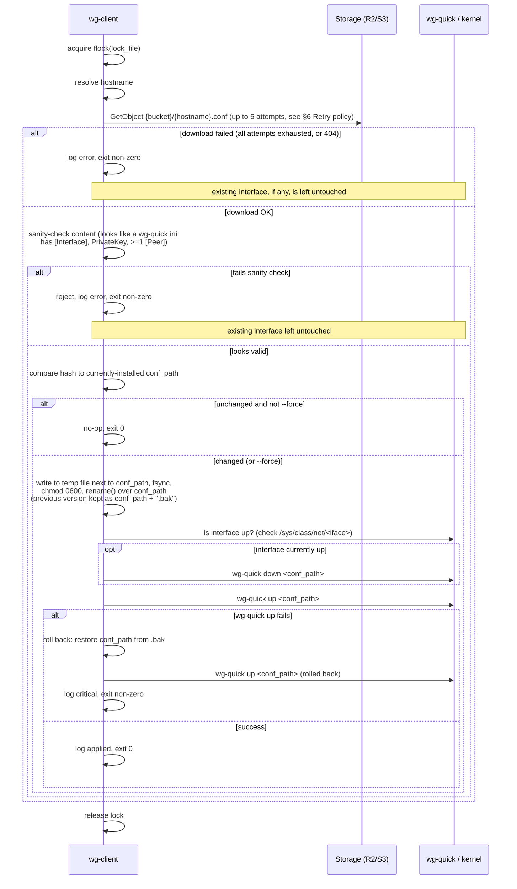

# `wg-client` — Design Document

Status: design only, no implementation yet.

## 1. Purpose

`wg-client` runs on every VPN node (master or spoke). It:

1. Reads a small JSON config with read-only storage credentials and a
   local target path.
2. Determines this node's own hostname.
3. Downloads `{bucket}/{hostname}.conf` (published by `wg-server`, see
   [docs/wg-server.md](./wg-server.md)) to the configured `conf_path`.
4. Brings the WireGuard interface down and back up using that file, so the
   node picks up the latest topology/keys.

It is meant to be safe to run unattended and repeatedly (cron/systemd
timer or a long-running daemon loop) without flapping the tunnel when
nothing changed.

## 2. Non-goals

- Does not generate keys or decide topology — it only applies what
  `wg-server` published.
- Does not manage firewall rules or routing beyond what's embedded in the
  downloaded `wg-quick` config (`PostUp`/`PostDown`, if `wg-server` ever
  adds them — none by default today).
- Does not provision the read-only credentials — the operator creates
  those and deploys the client config file out of band (config management,
  secrets manager, image bake, etc.).

## 3. CLI

```
wg-client sync --config <path> [--hostname <name>] [--once | --daemon] [--interval <duration>] [--force] [--lock-file <path>]
```

| Flag | Default | Meaning |
|---|---|---|
| `--config <path>` | required | Path to the client JSON config (§4). |
| `--hostname <name>` | system hostname | Overrides hostname detection (§5). Useful in containers/VMs where the system hostname doesn't match the fleet naming. |
| `--once` | default mode | Run a single sync pass and exit. |
| `--daemon` | off | Loop forever, sleeping `--interval` between passes, until `SIGTERM`/`SIGINT`. |
| `--interval <duration>` | `60s` | Only meaningful with `--daemon`. Accepts e.g. `30s`, `5m`. |
| `--force` | off | Reapply (down/up) even if the downloaded content is byte-identical to what's already at `conf_path`. |
| `--lock-file <path>` | `/run/wg-client.lock` | `flock`-based mutex so two invocations never race on the same interface. |

Exit codes: `0` success/no-op, `1` sync failed and no change was applied
(existing tunnel, if any, left running), `2` config/validation error.

## 4. Client configuration schema

```json
{
  "r2_config": {
    "endpoint": "https://<accountid>.r2.cloudflarestorage.com",
    "read_only_access_key_id": "",
    "read_only_secret_access_key": "",
    "region": "auto",
    "bucket": "wg-confs"
  },
  "conf_path": "/etc/wireguard/wg0.conf"
}
```

| Field | Type | Required | Notes |
|---|---|---|---|
| `r2_config.endpoint` | string (URL) | yes | Same endpoint the server publishes to. |
| `r2_config.read_only_access_key_id` / `read_only_secret_access_key` | string | yes | Should only grant `GetObject` (ideally scoped per node — see wg-server.md §12 security note). Must **not** be the read-write pair. |
| `r2_config.region` | string | yes | `"auto"` for R2. |
| `r2_config.bucket` | string | yes | Must match the bucket `wg-server` publishes to. |
| `conf_path` | string (path) | yes | Where the downloaded config is installed, e.g. `/etc/wireguard/wg0.conf`. The WireGuard **interface name** used for status checks (`wg show <iface>`) is derived from this path's filename stem (`wg0.conf` → `wg0`). |

Note: this config intentionally has no `hostname` field — the same config
file (baked into an image, or delivered by config management) can be
reused across many hosts as long as hostname is discoverable per-host
(§5).

## 5. Hostname resolution

Resolved in this order, first match wins:

1. `--hostname` CLI flag.
2. `WG_CLIENT_HOSTNAME` environment variable.
3. System hostname (`gethostname(2)`, e.g. via the `hostname` crate),
   lowercased.

The resolved value is validated against the same rule `wg-server` uses
(`^[a-z0-9]([a-z0-9-]{0,61}[a-z0-9])?$`) before being used to build the
object key `{hostname}.conf`. A mismatch here (e.g. system hostname has
uppercase or underscores) is a configuration error — fail with a clear
message rather than silently requesting a nonexistent object.

## 6. Sync algorithm



### Retry policy

The `GetObject` download is retried up to **5 attempts total** before
being treated as failed, matching `wg-server`'s policy (see
[wg-server.md §10](./wg-server.md#10-upload-to-storage)):

- Only transient errors are retried (timeouts/connection resets, 5xx,
  429 throttling), with exponential backoff and jitter between attempts
  (1000ms base, doubling, capped around 5s).
- A `404` (no `.conf` published for this hostname) is not retried — it's
  treated as a configuration problem, not a transient failure.
- Auth errors (401/403) are not retried either — retrying with the same
  bad credentials wastes the whole budget on a failure that will not
  change.
- Implementation note: `aws-sdk-s3`'s built-in `RetryConfig` with
  `max_attempts(5)` covers this without a hand-rolled retry loop.
- This is a single sync pass's retry budget, separate from and smaller in
  scope than `--daemon`'s outer retry-next-interval behavior (§7) — 5
  quick attempts within one pass, not 5 attempts spread across intervals.

Key properties this preserves:

- **Never tear down a working tunnel on a storage/network failure.** The
  interface is only brought down after a new config has been downloaded,
  sanity-checked, and hashed as different from what's running.
- **Never apply unparsable/partial content.** A shallow structural check
  (has the required sections/keys) runs before the file ever touches
  `conf_path`.
- **Rollback on apply failure.** If `wg-quick up` fails on the new config
  (e.g. a key was somehow malformed despite passing the shallow check),
  restore the last-known-good `.bak` and bring that back up rather than
  leaving the node with no tunnel at all.
- **No unnecessary flaps.** Content-hash comparison means a `--daemon`
  loop polling every minute doesn't bounce the interface every minute —
  only when the published config actually changed.

`wg-quick` is invoked directly against `conf_path` (not an interface name
looked up under `/etc/wireguard`), since `conf_path` is user-configurable
and may not live in `/etc/wireguard` at all. `wg-quick up /path/to/wg0.conf`
and `wg-quick down /path/to/wg0.conf` both accept a path directly.

## 7. Daemon mode

`--daemon` runs the same single-pass logic in a loop:

- Sleep `--interval` between passes (default `60s`), with a small random
  jitter (e.g. ±10%) so a large fleet doesn't hammer the bucket in
  lockstep.
- Catch `SIGTERM`/`SIGINT` for graceful shutdown between passes (never
  interrupt mid-apply).
- A failed pass logs and continues to the next interval rather than
  exiting the daemon — transient network/storage issues shouldn't kill a
  long-running service.
- Intended to run under systemd with `Restart=on-failure` as a backstop
  for anything that does cause the process to exit.

Example systemd unit (illustrative, not final):

```ini
# /etc/systemd/system/wg-client.service
[Unit]
Description=wg-client sync daemon
After=network-online.target
Wants=network-online.target

[Service]
Type=simple
ExecStart=/usr/local/bin/wg-client sync --config /etc/wg-client/config.json --daemon --interval 60s
Restart=on-failure
RestartSec=5

[Install]
WantedBy=multi-user.target
```

A `--once` + `systemd.timer` alternative works just as well if a
long-running daemon process isn't desired:

```ini
# /etc/systemd/system/wg-client.timer
[Timer]
OnBootSec=30s
OnUnitActiveSec=60s

[Install]
WantedBy=timers.target
```

## 8. Privileges

Managing a WireGuard interface (`wg-quick up/down`) requires root or
`CAP_NET_ADMIN` plus the ability to create/manage netlink devices, and
write access to `conf_path`'s directory. `wg-client` should check for
sufficient privilege up front and fail with a clear message rather than
letting `wg-quick` fail deep in the apply step.

## 9. Failure modes & resilience summary

| Failure | Behavior |
|---|---|
| Storage endpoint unreachable (transient) | Retried up to 5 attempts (§6); if all fail, log, exit non-zero, existing tunnel untouched. Daemon mode retries next interval. |
| Auth error | Not retried (§6). Log, exit non-zero, existing tunnel untouched. Daemon mode retries next interval (won't help until credentials are fixed). |
| Object not found (`404`) for this hostname | Not retried (§6). Log a clear "hostname not registered in wg-server config?" error, exit non-zero, existing tunnel untouched. |
| Downloaded content fails shallow validation | Reject before writing, exit non-zero, existing tunnel untouched. |
| `wg-quick up` fails on the new config | Roll back to `.bak`, bring that back up, exit non-zero. |
| Two `wg-client` invocations run concurrently | Second one fails to acquire `--lock-file` and exits immediately with a log message. |
| Content unchanged from last sync | No-op (no down/up), exit 0, unless `--force`. |

## 10. Security considerations

- The client config's read-only credentials should be scoped as narrowly
  as the storage provider allows (ideally per-node — see
  [wg-server.md §12](./wg-server.md#12-security-considerations)). Even
  read-only, they grant access to this node's own private key at minimum,
  and possibly the whole fleet's if the provider can't scope tokens
  per-object — deploy the config file with `0600` permissions via
  config-management/secrets tooling, not baked into a public image.
- The downloaded `.conf` at `conf_path` contains this node's private key
  and the preshared keys for its peers. `wg-client` sets `0600` /
  root-owned permissions explicitly on write, rather than relying on
  `wg-quick`'s own defaults.
- Content is validated structurally before being applied (§6) to reduce
  blast radius from a corrupted or tampered storage object; this is not a
  substitute for transport security (always use `https://` endpoints).

## 11. Dependencies (planned crates)

| Crate | Purpose |
|---|---|
| `clap` | CLI parsing |
| `serde`, `serde_json` | Config (de)serialization |
| `tokio` | Async runtime (required by the S3 SDK), also drives the daemon loop/interval + signal handling |
| `aws-sdk-s3`, `aws-config` | S3-compatible storage client (GetObject only) |
| `hostname` | System hostname lookup |
| `fd-lock` (or `fs2`) | `flock`-based single-instance guard |
| `sha2` | Content-hash comparison (skip-if-unchanged, rollback comparisons) |
| `thiserror` / `anyhow` | Error types |
| `tracing`, `tracing-subscriber` | Logging |
| `tokio::signal` | Graceful shutdown in `--daemon` mode |

## 12. Future enhancements

- `sd_notify` (systemd) integration for `Type=notify` readiness/watchdog.
- Prometheus textfile-collector or metrics endpoint exposing last sync
  time/result, for fleet-wide monitoring.
- Exponential backoff with jitter after repeated consecutive failures
  (instead of a fixed `--interval`).
- Optional post-sync hook script for site-specific routing/firewall
  adjustments.
