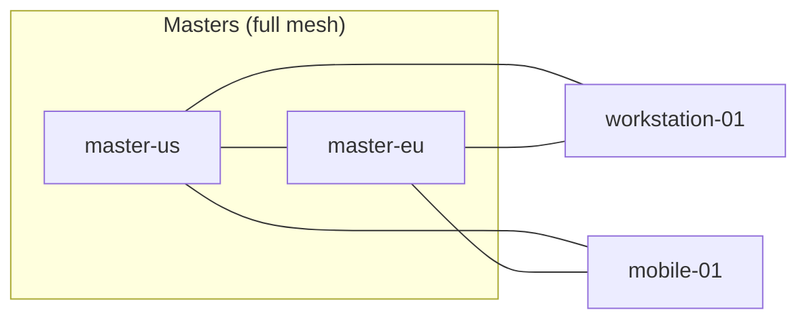

# `wg-server` — Design Document

Status: design only, no implementation yet.

## 1. Purpose

`wg-server` is a control-plane CLI tool run by an ephemeral cloud cron job
against a JSON topology file **daily at 00:00**.
The runner has no persistent filesystem, database, or local key store.
The storage bucket holds all durable publication state. The tool:

1. Validates the topology (unique hostnames, valid master list).
2. Generates WireGuard key material (private/public keypair per node,
   preshared key per allowed connection) — all randomly generated, never
   supplied by the operator.
3. Renders one `wg-quick`-format `.conf` file per node, encoding the correct
   set of peers for that node.
4. Uploads a complete immutable generation to an S3-compatible bucket
   (Cloudflare R2 in the reference deployment), then publishes it through
   `current.json` (§10). Independent `wg-client` jobs pull the latest
   generation **daily at 00:30** (see
   [docs/wg-client.md](./wg-client.md)).

`wg-server` never touches a live WireGuard interface itself — it only
produces and publishes configuration.

Use the same scheduler timezone for both jobs; these examples use UTC.
The nominal client slots are thirty minutes after the server slots. This
gives a healthy server run time to publish before the next client pass,
while both jobs still execute independently.

Keep the current generation and **one previous committed generation**.
Unchanged runs create no generation. Clients may skip generations and do
not acknowledge publication; neither publication nor retention waits for
them. A configuration or key change takes effect on each node at its next
successful sync, so publication does not imply simultaneous activation.

The cloud scheduler must serialize server jobs, including retries, manual
invocations, and retention cleanup. Skip or queue an overlapping trigger;
start a successor only after the previous process has terminated. This
coordination is provided by the scheduler, with no local lock or persistent
runner state. Conditional publication (§10) provides an additional conflict
check, but cannot by itself prevent concurrent cleanup from deleting an
active uploader's files.

## 2. Non-goals

- Does not manage the wg interface on any host (that's `wg-client`).
- Does not provision the storage bucket or IAM/API tokens — those are
  created by the operator ahead of time (see §12, Security considerations).
- Does not rotate keys on a timer; rotation is a manual, operator-triggered
  action (see §8, Key management).
- Does not provide full-tunnel/default-route VPN service, arbitrary
  `wg-quick` shell hooks, or automatic gateway firewall/NAT configuration
  in v1. Gateway forwarding and return routes are operator prerequisites.

## 3. Project layout (proposed workspace)

```
wg-vpn/
├── Cargo.toml         # workspace root
├── wg-common/         # shared: S3 client wrapper, wg-quick renderer,
│                      # config types, error types
├── wg-server/         # this binary
├── wg-client/         # sibling binary — docs/wg-client.md
└── docs/
    ├── wg-server.md
    └── wg-client.md
```

## 4. CLI

```
wg-server apply    --config <path> [--rotate [<hostname>]]... [--dry-run] [--prune]
wg-server validate --config <path>
```

| Flag | Default | Meaning |
|---|---|---|
| `--config <path>` | required | Path to the topology JSON (§5). Falls back to the `WG_SERVER_CONFIG` environment variable if omitted. |
| `--rotate [<hostname>]` | none | Force a brand-new random key for the given node(s) instead of reusing what's currently published (§8). Two forms: `--rotate <hostname>` (repeatable) rotates only the named node(s); bare `--rotate` with no value rotates **every** node in `--config`. Passing both a bare `--rotate` and one or more `--rotate <hostname>` in the same invocation is a validation error — pick one form. Implies `--prune` (see below). |
| `--dry-run` | off | Read published state and compute the plan (key reuse/rotation, generation publication, retention cleanup); print a summary without secrets. Perform no bucket writes or deletes. |
| `--prune` | off | Skip the retention grace period (§10) and delete anything outside `current`/`previous` immediately, instead of waiting the usual ~15 minutes. Automatically implied by `--rotate` in either form — see below. |

`validate` only runs schema + topology validation (§5–6), no key handling, no network calls.

The normal server command is `wg-server apply --config <path>`, on cloud
cron expression `0 0 * * *` in UTC.
It reuses existing keys; scheduling `apply` does not schedule rotation.
Retention cleanup is automatic and always runs, but by default waits out
the grace period described in §10. `--rotate` always forces immediate
cleanup (as if `--prune` were also given): rotation is already a
deliberate, manual/operator-triggered action, never part of the routine
unattended cron invocation, so there is no routine-job race for the grace
period to protect against, and there is no reason to leave a just-rotated
generation's old (possibly compromised) key sitting around for the
grace period. `--prune` is also available standalone (e.g. to force
immediate cleanup of a plain, non-rotating `apply`, such as when
testing/iterating and certain no concurrent apply is running). Node
removal takes effect by omitting the node and its peer edges from the next
generation, while the previous generation remains available under the
same one-generation retention policy.

## 5. Input configuration schema

```json
{
  "r2_config": {
    "endpoint": "https://<accountid>.r2.cloudflarestorage.com",
    "read_write_access_key_id": "",
    "read_write_secret_access_key": "",
    "region": "auto",
    "bucket": "wg-confs"
  },
  "nodes": [
    {
      "hostname": "master-us",
      "wg_config": {
        "tunnel_address": "10.10.0.1/32",
        "listen_port": 51820,
        "endpoint": "203.0.113.10:51820",
        "dns": "1.1.1.1",
        "mtu": 1420,
        "extra_allowed_ips": ["10.20.0.0/16"],
        "persistent_keepalive": null
      }
    },
    {
      "hostname": "master-eu",
      "wg_config": {
        "tunnel_address": "10.10.0.2/32",
        "listen_port": 51820,
        "endpoint": "198.51.100.20:51820"
      }
    },
    {
      "hostname": "workstation-01",
      "wg_config": {
        "tunnel_address": "10.10.0.100/32",
        "persistent_keepalive": 25
      }
    }
  ],
  "master": ["master-us", "master-eu"]
}
```

### Top-level fields

| Field | Type | Required | Notes |
|---|---|---|---|
| `r2_config` | object | yes | Storage credentials — see below. |
| `nodes` | array | yes | See below. |
| `master` | string[] | yes | Hostnames of master nodes — see below. |

### `r2_config`

| Field | Type | Required | Notes |
|---|---|---|---|
| `endpoint` | string (URL) | yes | HTTPS S3-compatible endpoint. The provider must support the consistency and conditional-write requirements in §10. Reject plaintext HTTP, URL userinfo, query strings, and fragments. |
| `read_write_access_key_id` | string | yes | Must have `PutObject`/`GetObject`/`ListBucket`/`DeleteObject` on `bucket`. |
| `read_write_secret_access_key` | string | yes | Secret half of the above. |
| `session_token` | string | no | Required when the supplied access-key pair represents temporary credentials. Load fresh credentials for every cron invocation. |
| `region` | string | yes | `"auto"` for R2; a real region for AWS S3/other providers. |
| `bucket` | string | yes | Bucket containing `current.json` and `nodes/` (§10). Reserve these names exclusively for this fleet. |

### `nodes[].wg_config`

| Field | Type | Required | Meaning |
|---|---|---|---|
| `tunnel_address` | string (IPv4 CIDR, e.g. `10.10.0.1/32`) | yes | Unique IPv4 unicast address with an explicit `/32` prefix. Written to this node's interface and advertised as a host route to its peers. |
| `listen_port` | integer | no (default `51820`) | UDP listening port, `1`–`65535`; randomized port `0` is unsupported. |
| `endpoint` | string or null | no | Reachable `IPv4:port`, `DNS-name:port`, or `[IPv6]:port`; port is `1`–`65535`. Omit/null for NAT'd nodes that initiate outbound handshakes. IPv6 transport is allowed even though v1 tunnel addresses are IPv4. |
| `dns` | string | no | One resolver IP address, parsed and rendered canonically as `DNS =` in this node's own interface. No arbitrary text or search-domain directives. |
| `mtu` | integer | no | `576`–`65535`, additionally limited by the host/underlay. Omit to use `wg-quick` auto-detection; setting it is an operator choice, not proof that the path supports it. |
| `extra_allowed_ips` | string[] (IPv4 CIDR) | no (default `[]`) | Canonical site-subnet routes through this node. Subject to the non-overlap and default-route restrictions in §6. |
| `persistent_keepalive` | integer or null | no | Local node's outbound keepalive interval, emitted in its own peer stanzas. `1`–`65535` seconds enables it; explicit `0` disables it. Missing/null defaults to `25` if the local endpoint is missing/null, and omits the line otherwise. |

### `master`

Array of hostnames. Every entry must exist in `nodes`. Duplicates are a
validation error.

## 6. Hostname & topology validation

Run for both `apply` and `validate`, before any key handling or network call:

- Parse JSON strictly: reject unknown fields, duplicate object keys,
  invalid types/ranges, empty required credentials, and invalid URLs.
  Missing optional fields use their documented defaults; only fields
  explicitly permitting null accept it. Reject CR, LF, NUL, and other
  control characters in all rendered string values. Render typed values,
  never concatenate raw operator text as config directives.
- Hostname must match `^[a-z0-9]([a-z0-9-]{0,61}[a-z0-9])?$` (DNS-label-safe,
  and safe as an S3 key / filename).
- Hostnames must be unique across `nodes`.
- `nodes` must be non-empty.
- Every entry in `master` must reference an existing hostname in `nodes`,
  and must not repeat.
- Warn (not error) if `master` is empty — no peer edges will be generated at
  all, which is very likely a mistake.
- Parse `tunnel_address` as an IPv4 unicast `/32`, and compare numeric IPs
  for uniqueness. Reject broader prefixes and IPv6 tunnel addresses in v1.
- Parse each extra route as a canonical IPv4 network. Reject host bits
  outside its prefix, duplicate/overlapping extra routes, `0.0.0.0/0`, and
  any extra route covering a node's tunnel address. Each advertised subnet
  has exactly one gateway; overlapping advertisements and automatic
  gateway failover are outside v1. Recheck disjoint prefix ownership on
  every rendered interface so peer selection cannot introduce ambiguity.
- Every generated edge must have a configured endpoint on at least one
  side. Hostname/port syntax is validated offline; DNS resolution, UDP
  reachability, forwarding, and NAT mappings are deployment checks (§7).
- The shared limits are 4096 nodes, 16 MiB for topology/discovery JSON,
  and 1 MiB for each rendered configuration. Each is an inclusive maximum:
  exactly 4096 nodes, a discovery JSON of exactly 16 MiB, or a rendered
  file of exactly 1 MiB is valid; the first byte/node past that is what's
  rejected. MiB means `1024 × 1024` bytes. Enforce limits before
  publication, so clients can use the same bounded parsers/downloads.
- A master's file holds one `[Peer]` stanza per *other* node in the fleet
  (§7), so its size scales with total node count, not master count: at
  roughly 200–300 bytes per stanza (more with long hostnames or
  `extra_allowed_ips`), a fleet near the 4096-node limit can push a
  master's own rendered file close to or past the 1 MiB cap even with as
  few as one master. Enforce the 1 MiB cap per rendered file as a hard
  `apply`-time validation error naming the offending hostname and its
  rendered size — never truncate or upload an oversized file. Operators
  approaching this limit should keep the number of nodes any single
  master must peer with well under the level implied by 1 MiB ÷
  (bytes per stanza), rather than relying on the nominal 4096-node ceiling
  in isolation.

## 7. Topology / peer-selection algorithm

Rules from the spec:

- Every master has a direct WireGuard peer relationship with every other
  node (master or not), subject to endpoint and host-network prerequisites.
- Masters fully mesh with each other.
- Non-master nodes cannot reach each other directly — only masters.

This is a hub-and-spoke topology with a fully-meshed hub set:



Edge set, pseudocode:

```
masters = set(config.master)
all_hosts = set(n.hostname for n in config.nodes)
spokes = all_hosts - masters

edges = set()
for (a, b) in combinations(masters, 2):        # master <-> master, full mesh
    edges.add(unordered_pair(a, b))
for m in masters:                              # master <-> every spoke
    for s in spokes:
        edges.add(unordered_pair(m, s))
# no spoke <-> spoke edges
```

Each edge becomes one `[Peer]` stanza in *both* endpoints' `.conf` files.

Peering is not a firewall policy. For a site gateway, the operator must
enable forwarding, permit the intended traffic, and install return routes
or appropriate NAT on the site network. Hosts must permit the WireGuard
UDP ports, and NAT'd nodes must initiate traffic toward a reachable peer.
Any spoke-to-spoke forwarding policy must be enforced explicitly on hubs;
absence of a direct spoke edge is not itself traffic isolation.

Storage access, endpoint DNS, and any configured resolver must remain
reachable over the node's underlying network when WireGuard is stopped
or peers have mismatched keys. Avoid advertising networks that would
capture this traffic. Clients check host-specific route conflicts before
application (§6 of wg-client); static topology validation cannot verify
every node's local LAN or changing DNS answers.

## 8. Key management

`wg-server` keeps no local database or key store between runs. On every
run it reads `current.json`, then obtains reusable keys from the complete
generation named by `current`. The pointer and retained `.conf` objects
are the only durable state; an interrupted job's memory or temporary
files are never needed for recovery.

A hostname absent from the current generation is a new node. An object
listed in that generation that is missing, corrupt, or unparsable is a
state-integrity error, not permission to silently generate a new identity.
Abort and report the affected node. Only a new node or an explicit
`--rotate` request gets freshly generated identity keys.

### Key types

| Key | Algorithm | Scope | Source |
|---|---|---|---|
| Private key | X25519 scalar generated from 32 CSPRNG bytes and clamped as required by WireGuard, Base64 | one per **node** | reused from the node's `.conf` in the current generation if registered and not rotating; otherwise freshly generated |
| Public key | derived from private key | one per **node** | recomputed from whichever private key was used (reused or fresh) |
| Preshared key | 32 CSPRNG bytes, Base64 | one per **edge** (unordered pair) | reused from both endpoints' matching current stanzas if neither endpoint is rotating; otherwise generated once per edge |

Preshared keys are symmetric in usage (the same value is written into both
endpoints' `PresharedKey =` line), but there is nothing to derive — the
value is reused after consistency validation, or generated once and
written to both sides. Validate canonical Base64 decoding to exactly 32
bytes, reject zero keys (which can disable key/PSK settings), and reject
duplicate node public keys. Use the same key validation in both binaries.

### Reuse and rotation rules

For each desired node (§7):

- If `--rotate` was passed bare, or `--rotate <hostname>` named this node:
  generate a fresh keypair after validating published state.
- Else, if the node is listed in the current generation: parse its
  `[Interface] PrivateKey =` line and reuse it (recompute the public key
  from it).
- Else (node absent from the current generation): generate a fresh keypair.

For each desired edge `(a, b)`, first validate its existing records when
both endpoints appear in the current generation. Derive their old public
keys from their current private keys, even if rotation is requested.
Match peers by those public keys, not hostname comments or mutable
addresses. If both reciprocal stanzas exist, require the same valid PSK.
A one-sided edge, conflicting PSKs, or duplicate peer public keys is an
integrity error; abort instead of choosing one endpoint arbitrarily.
Rotation must not hide inconsistent source state.

Then select the edge's PSK:

- If either endpoint is being freshly keyed, generate one fresh PSK for
  both endpoints. New identities must not reuse old PSKs.
- Otherwise, reuse the validated reciprocal PSK when the edge exists.
- If neither side records this edge, generate a fresh PSK. For example,
  promoting an existing spoke to master can create new edges without
  changing either endpoint's identity key.

This means an unrelated config change (e.g. editing one node's `dns`) never
perturbs any key material anywhere else in the fleet, with no separate
state to consult beyond the bucket contents `wg-server` already has to read
for the skip-if-unchanged upload check (§10) — reading existing objects
back serves both purposes in the same pass.

### `apply` algorithm

1. Validate input and rotation targets before any network call. Compute
   the desired node set and edge set (§7).
2. Fetch and validate `current.json`, retaining its ETag for conditional
   publication. Initialize an empty pointer for a new fleet as described
   in §10; never infer published state from orphan uploads. A dry run only
   plans initialization.
3. Fetch the current generation's files for desired nodes already listed
   there, with bounded parallelism. Verify their SHA-256 digests before
   parsing keys. Nodes not listed there have no reusable current identity.
4. Resolve node keypairs and edge preshared keys using the rules above.
5. Render every desired node's complete configuration (§9). Compare both
   the desired hostname set and configuration bytes with the current
   generation. If all match, keep the current/previous generation entries
   unchanged and proceed to the conditional revision refresh and retention
   cleanup in §10. No new generation is created.
6. Otherwise, generate a unique generation ID and upload **every** desired
   node's configuration under it, including files unchanged from the
   previous generation. Each generation is self-contained; it never
   depends on files belonging to an older generation.
7. After every upload succeeds, conditionally replace `current.json` with
   the new generation as `current` and the former `current` as `previous`
   (§10). On failure, leave the published pointer untouched or reconcile
   an uncertain result before doing any cleanup.
8. Automatically remove generations outside `current` and `previous`,
   including abandoned uploads from terminated jobs (§10). This also runs
   on unchanged passes. `--dry-run` reports these decisions without
   executing steps 6–8's writes or deletes.

## 9. Rendered `wg-quick` format

Peers are emitted in sorted hostname order for stable, diff-friendly
output. Example for `master-us` (a master, so it peers with `master-eu` and
every spoke):

```ini
# Managed by wg-server — do not edit manually.
# Hostname: master-us

[Interface]
PrivateKey = <master-us private key>
Address = 10.10.0.1/32
ListenPort = 51820
DNS = 1.1.1.1
MTU = 1420

[Peer]
# master-eu
PublicKey = <master-eu public key>
PresharedKey = <master-us|master-eu psk>
AllowedIPs = 10.10.0.2/32
Endpoint = 198.51.100.20:51820

[Peer]
# workstation-01
PublicKey = <workstation-01 public key>
PresharedKey = <workstation-01|master-us psk>
AllowedIPs = 10.10.0.100/32
```

In `workstation-01`'s own configuration, its entry for `master-us` is:

```ini
[Peer]
# master-us
PublicKey = <master-us public key>
PresharedKey = <workstation-01|master-us psk>
AllowedIPs = 10.10.0.1/32, 10.20.0.0/16
Endpoint = 203.0.113.10:51820
PersistentKeepalive = 25
```

The workstation also sends keepalives to `master-eu`. The masters do not
inherit the workstation's keepalive setting: the NAT'd node sends packets
to maintain its own mapping
([WireGuard guidance](https://www.wireguard.com/quickstart/#nat-and-firewall-traversal-persistence)).

Notes:

- No generation timestamp is embedded in the file — content is a pure
  function of resolved keys + topology, which keeps the skip-if-unchanged
  comparison in §10 meaningful (no line changes on every run just because
  time passed). Use the object's S3 `LastModified` metadata if "when was
  this last published" is needed.
- `Endpoint =` is only emitted for a peer if that peer's own `wg_config.endpoint`
  is set.
- `PersistentKeepalive =` is determined from the **local node** and emitted
  in each of that node's peer stanzas using §5's default/override rules.
- `AllowedIPs =` is the peer's `tunnel_address` plus its `extra_allowed_ips`,
  comma-joined.
- Render UTF-8 with LF line endings and a final newline. Sort peers by
  hostname and extra routes by numeric network/prefix; normalize addresses,
  key encodings, and optional defaults for deterministic comparison.
- Emit only the directive subset accepted by wg-client §6. Never generate
  `PreUp`, `PostUp`, `PreDown`, `PostDown`, `SaveConfig`, or arbitrary shell
  text. Validate every rendered file with the shared parser before upload.

## 10. Upload to storage

### Storage layout and generation discovery

The configured bucket has two reserved names:

```text
current.json
nodes/<hostname>/<generation-id>.conf
```

`current.json` is the fixed discovery object fetched by both the server
and every client. It contains the current generation and at most one
previous committed generation. Each entry includes the complete hostname
set and each configuration's SHA-256 digest. For example:

```json
{
  "schema_version": 1,
  "revision": "0eadndcbb7ved8xd0x34e6229z4ecbhqd5nmr6krre4bk4kp32xm",
  "current": {
    "id": "189c8r7s5x4dcvhq7acet5dr0zpc592e13rxd8xgk3nqe1hxj9d4",
    "nodes": {
      "master-us": "17670h05q0z785jbt19b4vsyqrggq6rkna7s21764kzas2p5dgs2",
      "workstation-01": "0m205js6jn658mf9j5y9k9wee9yvgv14bsdmt4ne8k2nexyx10j1"
    }
  },
  "previous": {
    "id": "0j530zh3377p9035zg0jbex7hpf30g8zmt476nwxr0g41kjs31nf",
    "nodes": {
      "master-us": "0eadndcbb7ved8xd0x34e6229z4ecbhqd5nmr6krre4bk4kp32xm"
    }
  }
}
```

The IDs and digests above are illustrative. Generate each ID from **32
CSPRNG bytes**. Compute each configuration digest using **SHA-256 over the
exact uploaded bytes**, yielding 32 digest bytes. Both use the same text
encoding: interpret the bytes as an unsigned big-endian 256-bit integer,
encode in **lowercase Crockford Base32**, and left-pad with `0` to exactly
**52 characters**. Use alphabet `0123456789abcdefghjkmnpqrstvwxyz`, with
no separators, `=` padding, or check symbol. The four unused high bits are
zero, so the first character is `0` or `1`. The canonical validation rule
for both IDs and digests is `^[01][0-9abcdefghjkmnpqrstvwxyz]{51}$`.
Reject uppercase and the usual human-input aliases (`i`, `l`, `o`). This
uses the [Crockford alphabet and numeric
encoding](https://www.crockford.com/base32.html) with lowercase output.

**This is not RFC 4648 Base32.** RFC 4648 groups input into fixed 5-byte
blocks and encodes each block's bits independently (with `=` padding on a
short final block); Crockford's encoding treats the entire input as one
big-endian integer. For a 32-byte input the two schemes produce
**different, same-length strings** for the same bytes. A stock Base32
crate (e.g. Rust's `base32` or `data-encoding`, which implement RFC 4648)
will silently produce the wrong value if reached for here — this
encoding must be implemented as a big-integer conversion (e.g. via
`num-bigint`, or a manual repeated divide-by-32 loop) in the shared
`wg-common` module, not via a generic Base32 dependency, with unit tests
that pin its output against known values derived from this specification
(see [milestones.md](./milestones.md)) rather than trusting a generic crate.

Use this encoding for **all application-defined digests**, including
publication metadata, logged hashes, and clients' persisted applied
hashes. Hash computation remains deterministic; generation IDs and pointer
revisions are random. Storage ETags are opaque provider values and must be passed back
unchanged, and WireGuard keys retain their required Base64 format. IDs
contain no timestamp and must never be sorted to discover the latest
generation.

`revision` is a fresh 32-byte CSPRNG nonce using the same canonical
encoding as generation IDs. Change it on every pointer mutation, including
initialization, recovery, and the refresh before unchanged-pass cleanup.
It fences delayed conditional writes from earlier invocations without
creating another configuration generation. Clients use `current.id` for
discovery; a revision-only update does not trigger local application.

Node names follow §6. Reject unknown fields, unsupported schema versions,
duplicate JSON keys, malformed entries, and equal current/previous IDs.
Each non-null generation contains a nonempty hostname-to-digest map within
the shared limits; `current: null` requires `previous: null`. Derive object
paths from these validated values; the discovery object supplies no
arbitrary URL or filesystem path.

`previous` is `null` until a second generation is committed. Before the
first publication, both `current` and `previous` may be `null`; clients
then report that no generation has been published. An absent pointer may
be initialized to this empty state with a fresh revision and
`If-None-Match: *` only when listing confirms the reserved `nodes/`
namespace is empty. Distinguish `NoSuchKey` from a missing bucket or denied
access; initialization requires a successful listing in the intended
existing bucket. Existing generation objects with no pointer indicate
lost or inconsistent state and require explicit recovery. Initializing
the pointer before staging files lets the next
cron job recognize an interrupted first publication.

A client named `workstation-01` reads `current.json`, selects `current`,
looks up its digest, and downloads
`nodes/workstation-01/189c8r7s5x4dcvhq7acet5dr0zpc592e13rxd8xgk3nqe1hxj9d4.conf` in this
example. It verifies the digest before local application. It needs no
bucket listing, synchronized clock, server notification, or remembered
remote generation ID. See [wg-client.md §6](./wg-client.md#6-sync-algorithm).

Configuration objects use `Content-Type: text/plain; charset=utf-8`; the
pointer uses `Content-Type: application/json`. Set `Cache-Control: no-store`
on both and use the authenticated storage endpoint directly. Each new
generation includes every node's full file, even if only one file changed.
An entirely unchanged topology and rendered content leave both retained
generation entries unchanged; the revision may refresh to fence cleanup.

### Retry policy

Every individual storage call — `GetObject`, `PutObject`, `DeleteObject`,
`ListObjectsV2` — is retried up to **5 attempts total** before being
treated as failed:

- Only transient errors are retried: network timeouts/connection resets,
  retryable 5xx responses, and throttling (429 or provider throttling error
  codes). Auth failures (401/403) and other
  non-retryable errors fail immediately without consuming retries.
- A 404 for a configuration referenced by `current.json` is an integrity
  error. Node absence is determined from the pointer's hostname set, not
  from a missing object. Handle an absent pointer using the initialization
  rules above.
- Backoff between attempts is exponential with jitter (1000ms base,
  doubling, capped at 5s). Configure both the attempt limit and the
  backoff cap explicitly in the SDK.
- A streamed-body failure restarts the whole download only within the
  remaining per-call attempt budget. SDK and body retries share the same
  five attempts; never multiply nested retry budgets.
- Set finite request/attempt and body-download deadlines, plus an overall
  job deadline within the scheduler's execution limit. Use at most eight
  concurrent storage calls, a 10s request-attempt timeout, a 30s total
  deadline per call including body consumption, and an 8-minute overall
  job deadline. SDK request timeouts alone do not cover consuming a
  returned response stream
  ([AWS timeout documentation](https://docs.aws.amazon.com/sdk-for-rust/latest/dg/timeouts.html)).
- A conditional-write conflict is not a transient error to blindly retry.
  Reconcile it using the publication rules below. A timed-out write has
  an unknown outcome, not a confirmed failure to store data.

### Publication commit

1. Upload each node's file using the new generation ID. Use
   `If-None-Match: *` to prevent overwriting an existing object. Reuse the
   same ID and bytes for retries
   within this invocation. If a retry finds the object already present,
   verify its exact content; an identical upload is complete, while
   different content is an integrity error.
2. Await all uploads. Only after every file is confirmed stored, replace
   `current.json` using `If-Match` with the ETag read before planning.
   Set `current` to the complete new entry and `previous` to the former
   `current` entry, with a fresh revision. All change in the same object
   write; use the same revision and intended bytes for its retries.
3. If the pointer write times out or returns a conflict, reread it. If it
   exactly matches this invocation's intended pointer, the commit succeeded.
   If it still matches the original pointer and ETag, the same conditional
   write can be retried within the bounded budget. If another value is
   present, report a conflict and stop. If its state cannot be read, report
   an unknown commit outcome. Do not delete any candidate generation while
   the outcome is unknown.
4. A failed upload leaves the published pointer and its configurations
   unchanged. Abandon the candidate generation for subsequent cleanup;
   no compensating overwrite of live configurations is necessary.

This requires strong read-after-write consistency and conditional writes
from the storage provider. R2 supports these primitives
([consistency model](https://developers.cloudflare.com/r2/reference/consistency/),
[S3 API compatibility](https://developers.cloudflare.com/r2/api/s3/api/)).
The pointer commits discovery of a complete snapshot; it does not switch
live WireGuard interfaces together. All readers must follow `current.json`
instead of listing the bucket or choosing a generation by name or age.

### Retention: current plus one previous generation

After a confirmed commit, reread and validate that the pointer still
matches this invocation's committed revision and retained entries. On an
unchanged pass, first conditionally refresh only `revision` using the
observed ETag and verify that write using the same reconciliation rules as
publication. If this fails or its result is unknown, skip cleanup.

This revision change invalidates an older job's in-flight conditional
commit even if that job's process has already terminated. Otherwise a
delayed commit could publish candidate files after the next unchanged run
deleted them. Retained configuration generations do not change during a
revision refresh. The scheduler must still prevent live overlapping jobs;
revision refresh alone does not protect concurrent staging/cleanup.

Under the scheduler's exclusive execution guarantee (§1), list
all pages beneath the reserved `nodes/` prefix and delete recognized
generation objects whose ID is neither `current.id` nor `previous.id`.
This removes older committed generations and abandoned uploads. Never
delete either retained generation, the pointer, or unrelated bucket keys.
Recognize only `nodes/<valid-hostname>/<valid-generation-id>.conf`; skip
and report unexpected names. Compare IDs for membership in the retained
pair, never for chronological order. When an entry is null, it contributes
no retained ID.

As a defense-in-depth layer under the scheduler's guarantee — not a
replacement for it — skip deleting any candidate object whose
`LastModified` is younger than a fixed grace period (e.g. 15 minutes).
This bounds the exact race named in §1 (conditional publication cannot by
itself stop concurrent cleanup from deleting an active uploader's files):
a legitimate in-flight upload from an overlapping job is always younger
than its own upload started, so a grace period comfortably longer than
the 8-minute job deadline ensures cleanup never deletes a file that could
still belong to a run still in progress, while still reclaiming genuinely
abandoned uploads on the next successful cleanup pass. This does not
change what counts as *retained* — that remains pointer membership, never
age — it only delays when an already-orphaned object becomes eligible for
deletion.

After successful cleanup the bucket contains the current generation, at
most one previous committed generation, and possibly a handful of
recently-orphaned objects still inside the deletion grace period above. A
newly initialized fleet has no previous generation. Upload staging
temporarily uses additional space; a crash or failed delete can leave
extra objects until the next successful cleanup. Report cleanup failures
separately from publication success and retry them on the next cron run,
including runs with unchanged content. There is no retained archive
beyond the one previous generation and whatever the grace period is
still holding.

Provision unversioned storage without retention locks for these objects.
S3 versioned or versioning-suspended buckets are outside this v1 cleanup
protocol: a normal delete can leave older versions and delete markers
([S3 object-version deletion](https://docs.aws.amazon.com/AmazonS3/latest/userguide/DeletingObjectVersions.html)).
Do not configure age-based lifecycle expiry for the reserved namespace;
an unchanged current generation may remain active indefinitely. Retention
must follow pointer membership rather than object age.

Retention is independent of client schedules. For example, suppose changes
produce G0 on day 1, G1 on day 2, and G2 on day 3, each at 00:00. A client
that applies G0 at 00:30 on day 1 but misses day 2 goes directly to G2 at
00:30 on day 3. Only G2 and G1 are then kept in the bucket; the client's
existing local G0 file is unaffected. If cleanup removes an object after
a client reads its generation ID but before it downloads the file, the
client rereads the pointer and retries
the latest generation with a bounded retry budget (§6 of wg-client).

Keeping one previous generation provides recovery data. It does not make
old and new WireGuard keys concurrently valid or require clients to replay
intermediate generations. With healthy daily client scheduling and a
stable current generation, adoption occurs at each client's next run,
plus scheduling jitter and download/apply time. Offline clients have no
bounded adoption time. Key rotations and incompatible address/topology
changes can interrupt affected links during this transition; routine
scheduled server jobs must not request key rotation. The 8-minute server
deadline normally fits within the thirty-minute offset to the next client
slot, but delayed/failed jobs can miss that slot; the schedule is not an
activation barrier or a zero-downtime guarantee.

## 11. Error handling

- Schema/topology validation errors (§6) abort before any key handling or
  network call — fail closed.
- Invalid discovery metadata, missing referenced files, digest mismatches,
  or unparsable current keys abort publication without incidental rotation.
- An upload failure leaves the current generation published. A pointer
  write with an uncertain result is reconciled by reading `current.json`
  (§10), never by assuming the write failed and deleting its objects.
- A cleanup failure exits non-zero with `publication=committed` or
  `publication=unchanged` and `cleanup=incomplete` in the summary. The
  current generation remains usable and the next serialized job retries
  cleanup from bucket state.
- After a crash, a normal scheduled `apply` resumes from the pointer,
  reuses its current keys, and collects abandoned data after a successful
  pass. No local transaction journal survives or is needed. Integrity
  errors require explicit recovery instead of blind repeated rotation.
- Reissuing `apply --rotate` creates another rotation, even if a prior
  invocation already committed but lost its response. Inspect publication
  state before manually repeating a rotation; the normal cron command
  contains no `--rotate` flag. (The packaged `docker/` cron image and
  `package/`'s `wg-server.service` are intentional exceptions — both
  bake in a bare `--rotate`, so every scheduled run there does rotate
  the whole fleet; see `docker/README.md`'s "Rotation on every run" for
  the operational tradeoffs that choice accepts.)

For recovery from damaged published state, stop scheduled publication and
confirm the previous job has terminated. Verify the retained previous
snapshot's digests and configuration consistency before using it. An
operator can conditionally restore the pointer to that verified snapshot
with `previous: null` and a fresh revision, using trusted storage tooling,
then correct the topology input and resume normal `apply`. Do not infer
trusted keys from unreferenced files or retain a damaged snapshot as the
fallback. If neither retained snapshot is usable, explicit re-enrollment
is required. Recovery
is a new publication decision and still propagates on client schedules.

## 12. Security considerations

- Supply the input config and **read-write** credentials through the cloud
  job's secret/configuration mechanism. Use owner-only temporary files,
  restrictive creation permissions, and no persistent runner storage.
  The input JSON is supplied afresh on each invocation; environment-based
  secret injection belongs to the job wrapper, not implicit SDK credential
  fallback. Never commit real credentials or rendered private configs.
- Keep the bucket private, with public endpoints/CDN access disabled.
  Each client must receive distinct credentials permitting `GetObject`
  only for `current.json` and its own `nodes/{hostname}/` prefix. The
  server has read/write/list/delete permissions for the reserved namespace.
  Bucket-wide client credentials would expose every private key and are
  unsuitable for node isolation; random generation IDs do not fix this.
- R2 supports scoped temporary credentials with exact-object and prefix
  restrictions. The out-of-band credential issuer grants `current.json`
  plus the node prefix, supplies the access key, secret key, and session
  token, and renews them before expiry. Keep issuer/parent credentials off
  VPN clients. The stable node prefix continues to work across generations
  ([R2 temporary credentials](https://developers.cloudflare.com/r2/api/s3/temporary-credentials/)).
  For GetObject-only R2 credentials, the issuer can locally sign a scoped
  token with `actions: ["GetObject"]`, `paths.objectPaths: ["current.json"]`,
  and `paths.prefixPaths: ["nodes/<hostname>/"]`. Broader object-read-only
  presets can also grant listing, which this client does not require.
  A provider/deployment unable to enforce per-node reads requires a
  different isolation mechanism before deployment; per-node encryption
  remains a possible future mechanism rather than a v1 implementation.
- The shared discovery object exposes fleet hostnames and content digests,
  but no private keys or PSKs. Access to it is part of the client trust
  model; deployments requiring private fleet membership need a different
  discovery mechanism.
- Both binaries enforce `https://` and normal certificate validation in
  their own configuration validation. The SDK permits HTTP endpoints; it
  must not be relied on to reject them
  ([SDK endpoint documentation](https://docs.aws.amazon.com/sdk-for-rust/latest/dg/endpoints.html)).
- Both retained generations contain private keys; deletion or removal from
  the current topology does not revoke previously downloaded keys or
  storage credentials. Digests detect incomplete or corrupted downloads,
  but do not authenticate content against someone who can replace both
  the configurations and `current.json`.
- Because reuse is read back from the bucket itself, anyone with
  **write** access to the bucket could plant a malicious `.conf` for a
  node ahead of an `apply` run and have `wg-server` treat its (attacker-
  chosen) `PrivateKey` as legitimate to reuse. This is not a new exposure
  in practice — anyone with write access to the bucket could simply upload
  a malicious `.conf` directly and skip `wg-server` entirely — but it's
  worth stating plainly: the read-write credentials in `--config` are the
  actual trust boundary for the whole fleet, not `wg-server`'s logic.

To remove a node, revoke its storage credentials and remove it from the
topology/master list, then publish. Confirm remaining affected peers have
applied the removal; publication alone does not revoke an offline peer's
cached configuration. For urgent revocation, block the node at the host or
network firewall while scheduled updates propagate. If bucket-wide client
credentials were ever exposed, revoke them and treat the fleet's private
keys and PSKs as compromised, requiring a controlled fleet rotation. The
previous generation's retained keys are secret recovery material,
not authorization to reconnect a removed node.

## 13. Logging & observability

- Structured logs (`tracing`), one line per hostname processed
  (`reused` / `rotated` / `uploaded` / `skipped-unchanged`), plus a final
  summary naming current/previous generation IDs, publication outcome,
  nodes/edges freshly keyed, and cleanup counts/failures.
- `--dry-run` prints the planned publication and cleanup without writes,
  deletes, configuration bodies, or secret key material. A later real
  invocation re-reads state and computes its own plan.
- Redact credential fields, private keys, PSKs, config bodies, SDK request
  signing headers, and parser error values. Log field names, hostnames,
  generation IDs, digests, and sanitized error categories instead. Disable
  secret-bearing debug dumps and core dumps in the job environment.

## 14. Dependencies (planned crates)

| Crate | Purpose |
|---|---|
| `clap` | CLI parsing |
| `serde`, `serde_json` | Config (de)serialization |
| `tokio` | Async runtime (required by the S3 SDK) |
| `aws-sdk-s3`, `aws-config` | S3-compatible storage client, with custom endpoint + `auto`/path-style support for R2 |
| `x25519-dalek`, `rand` | WireGuard-compatible key generation, PSKs, and 32-byte random generation IDs |
| `base64` | WireGuard configuration key encoding |
| `sha2` | SHA-256 digest computation over rendered configuration bytes |
| `wg-common` (shared crate, §3) | Strict config parser/renderer and key validation shared with `wg-client`; wraps `ipnet`/`url` for typed route/endpoint validation and implements the canonical lowercase Crockford Base32 encoding for IDs/digests (§10) — both binaries call this one implementation rather than each reimplementing the encoding |
| `thiserror` / `anyhow` | Error types |
| `tracing`, `tracing-subscriber` | Logging |

## 15. Future enhancements

- Scheduled key rotation with durable operation IDs in bucket metadata
  for idempotent retries, plus a documented maintenance/rollout policy.
- Per-node scoped storage tokens generated and rotated by `wg-server`
  itself, if the provider exposes a token-management API.
- Optional per-node encryption of `.conf` contents at rest.
- IPv6 tunnel addresses / dual-stack `AllowedIPs`.
- Webhook/notification on publish (e.g. notify a chat channel of topology
  changes).
- Terraform/Ansible provider wrapping `wg-server apply` for GitOps-style
  fleet management.
